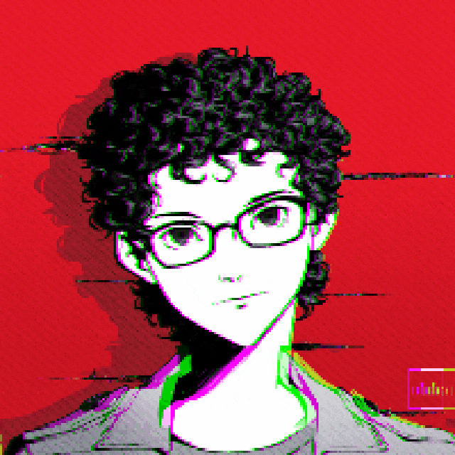
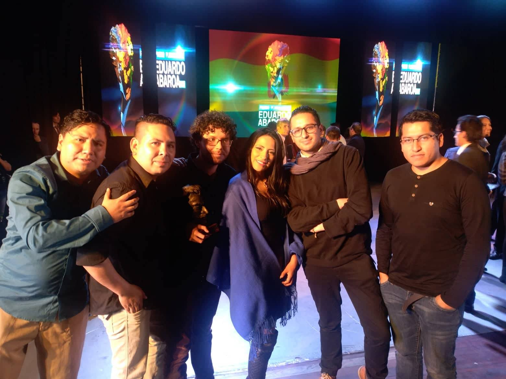

***

Developing games, learning XR, also into QA automation.

# Contact

> [Email](mailto:ja.jdavidrevillad@gmail.com)

# Tools

***

*   Unity

*   Renpy

*   Godot

# Languages

***

*   English

*   Spanish

*   Japanese

# About Me

***

I’m mostly interested in games as narrative experiences from adventure games to visual novels, point-and-click, and puzzles as well as evocative experiences.

When I’m not working I’m interested in interacting and learning from different cultures, their legends, their stories, and the occult in general, I also like to experiment in the kitchen and consuming every kind of media.

If you like my work (or want to talk about the multiculturalism in Bolivia) please contact me :)

> Github: el-nuru

> ItchIO: [el\_nuru](https://el-nuru.itch.io/)

## NSFW here

(we are adults don't be scared)
